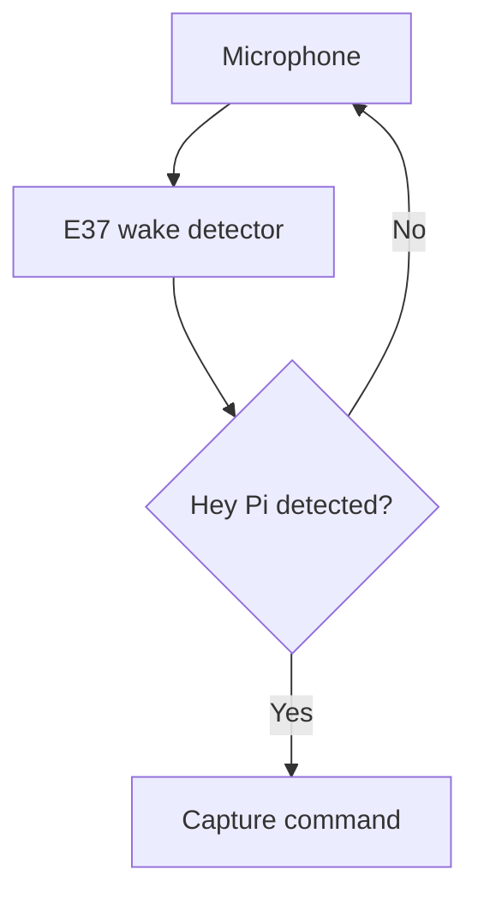
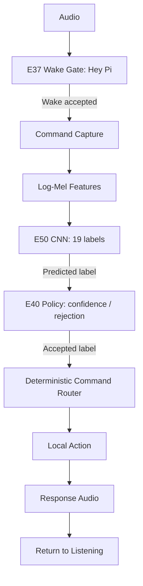

# PROJECT_WAKE GATE

Submission update note (2026-10-02): a later read-only recovery audit found the E37 `Hey Pi` wake-recording manifest on the Raspberry Pi at `/home/loreenanne/vcm_pi_package/pi_validation/wake_validation_hey_pi/manifest.csv`. The recovered manifest documents 99 wake-stage recordings, including 50 `WAKE` / `hey pi` recordings, 64 adaptation-designated rows, and 35 holdout-designated rows. This update establishes recording-set counts that were not available to the original document below. The exact final E37 training subset, speaker/recordist count, training epochs, optimizer, validation metrics, and augmentation count remain not established. See `FINAL SUBMISSION VCM\E37_HEY_PI_DATASET_EVIDENCE_RECOVERY_AUDIT_20261002.md`.

The E50 system separates wake recognition, command recognition, and action mapping. The important point is that the wake gate was not trained to recognize all commands. Its job was only to detect the wake phrase and open the command-recognition window.
## 1. Wake gate: E37
The frozen wake model is:

`E37_TARGETED_COLOR_VOLUME_FIX`

Its role is:
Microphone → wake detector → command window
The wake detector listens for the designated wake phrase, “Hey Pi.” When its confidence reaches the frozen wake threshold of 0.90, the system treats the wake as detected and proceeds to command capture. If the wake condition is not met, it stays in the listening state.
The final E50 runtime therefore has:

The final E37 weights and normalization were frozen as part of E50; the recorded SHA-256 values are documented in the final package.

*Source: E50_Demo_Day_Fact_Sheet_REVISED*
## 2. What was trained for the wake stage?
The wake recording script records 4-second mono audio at 16 kHz through ALSA using arecord. It writes a manifest with fields such as label, phrase, trial, split, WAV path, duration, sample rate, and device. The script treats the manifest as the source of truth for recorded wake data.
The split logic in that script keeps some wake examples for holdout and uses the earlier examples for adaptation. For WAKE, the final 9 trials are assigned to holdout; for non-wake examples, the final trial is assigned to holdout.
What I can say from the inspected evidence is: the project explicitly built the wake gate around WAKE versus false-wake / non-wake rejection behavior. I did not find, in the inspected excerpts, a full E37 training-manifest breakdown equivalent to the E50 command-model manifest, so I would not invent exact E37 training row counts beyond what the project evidence directly establishes.
The available E50 fact sheet establishes the E37 model identity and its role, but it does not provide enough information to claim an exact numerical E37 training-dataset composition—for example, the precise number of positive “Hey Pi” clips, negative clips, speakers, augmentation counts, or training epochs.
So I would not describe the wake dataset using the E50 command-dataset numbers. Those numbers belong to the command-recognition training data, not automatically to E37.
What can be stated safely is:
- E37 was a separate wake-detection model.
- It was specifically developed for the wake stage.
- The final frozen E50 runtime uses E37.
- Its deployment threshold is 0.90.
- It operates before E50 command recognition.

*Source: E50_Demo_Day_Fact_Sheet_REVISED*
## 3. Command recognition is a separate model
Once E37 accepts the wake phrase, the system captures the following spoken command.
That audio goes through log-Mel preprocessing and into:

`E50_BG_REVISED_VOCAB_ORIGINAL_PRESERVE_E41_INIT`

The command CNN has 19 output labels and an input tensor of (398, 40, 1). It has 66,483 parameters.

*Source: E50_Demo_Day_Fact_Sheet_REVISED*
The final command-training manifest contained 16,100 training rows:
| Source | Rows |
| --- | ---: |
| Active-project training data | 13,070 |
| Dataset2 | 2,800 |
| E41 reconstructed adaptation | 230 |
| Total | 16,100 |

The underlying VCM_MASTER dataset contained 36,622 samples across 16 classes, with 27,130 training, 4,734 validation, and 4,758 test samples. VCM_BALANCED contributed 15,268 training samples, derived from training data.

*Source: E50_Demo_Day_Fact_Sheet_REVISED*
So the training process was essentially:

Spoken command recordings → dataset curation / mapping → 16,100-row E50 training manifest → log-Mel representation → small CNN → 19-class output.

## 4. How does speech become an action?
This is the important distinction: the CNN does not directly execute an action.
It produces a label prediction.
For example:

1. The user says “Hey Pi.”
2. E37 accepts the wake phrase.
3. The user says “Play music.”
4. The E50 CNN predicts `PLAY_MUSIC`.

Then E40 checks whether that prediction satisfies the confidence policy.
For example, the default command threshold is 0.90, but several commands have higher thresholds, such as:
| Command | Threshold |
| --- | ---: |
| `NEXT` | 0.98 |
| `CREATE_REMINDER` | 0.96 |
| `VOLUME_UP` | 0.99 |
| `STOP` | 0.995 |
| `PAUSE` | 0.99 |
| `TIME` | 0.98 |

*Source: E50_Demo_Day_Fact_Sheet_REVISED*
Only after that filtering does the deterministic router map the recognized label to an action.
## 5. The complete mapping architecture
So the actual architecture is:

The project documentation explicitly describes this final chain as Pi microphone → E37 wake detection → command capture → log-Mel preprocessing → E50 command CNN → E40 confidence/rejection → deterministic command router → local action → local response audio → return to listening.

*Source: E50_Demo_Day_Fact_Sheet_REVISED*
## In simple terms

Think of the system as having three different learning/decision layers:
## 1. E37 learns:
   “Did the user say my wake phrase?”
## 2. E50 learns:
   “Which of my 19 known command categories does this audio most resemble?”
## 3. E40 + router determine:
   “Is that prediction confident enough to accept, and if accepted, which deterministic action corresponds to that label?”
So it is not:

`speech → neural network → arbitrary action`

It is:

`speech → wake detection → command classification → confidence gate → fixed label-to-action mapping → action`

That distinction is particularly important when explaining E50 to a technical reader, because it shows that the voice-recognition model and the action-execution mechanism are deliberately separated.

